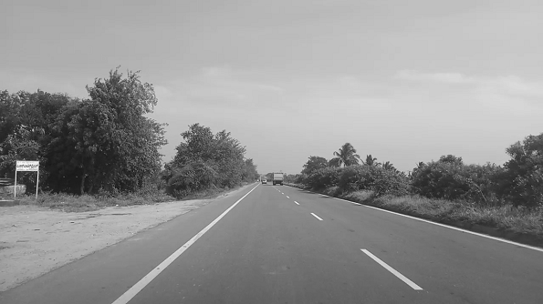
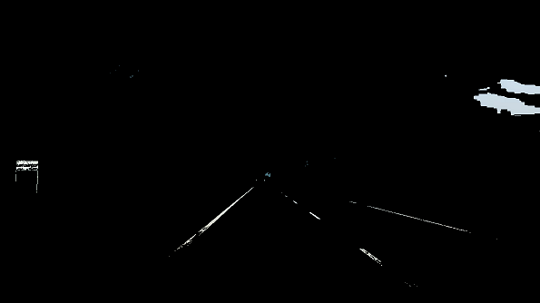
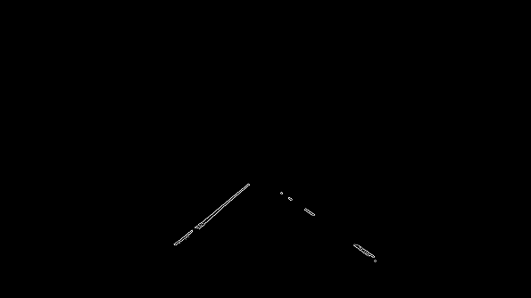
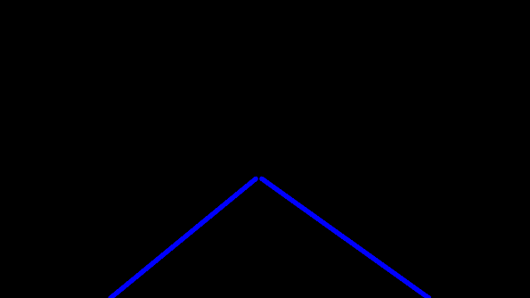
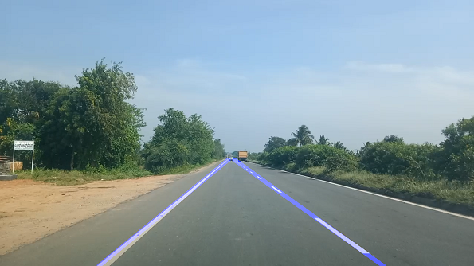

# Lane_and_Vehicle_Detection_for_Driver_Assistence

This project is implimented with “Open Source Computer Vision Library”, the OpenCV. The aim was to impliment real time simple lane detection and vehicle detection system with OpenCv Python for self driving cars.
the lane detection system is a very basic yet very important system when we talk about driver assistance systems or self driving cars. Since 1990s threr have been lot of work 
done on lane detction systems for various road conditions. like urban and rural roads,highways etc. The lane detection system can play a major role in the 
driver assistance system. Adding vehicle detection ststem along with the lane detection system can significuntly improve the decision making capability of ADAS systems.
by understanding the dynamics of the vehicles.Some of the applications of lane detection systems are 
1.Lane keep assistance
2.Lane departure warning
3.Road vulnerability detection
## Installation

Use the package manager [pip](https://pip.pypa.io/en/stable/) to install packages mentioned in requirment.txt.

```bash
pip install -r requirment.txt
```

## Implimentetion Steps

This project is implimented in two distinct phases:
###1. Lane Detection with OpenCv.
The input to this system is video feed from the camera mounted on the fron t side of the back veiw mireor inside the cabin.
step by stemp implimentation is given below.

```python
#importing some useful packages
import matplotlib.pyplot as plt
import matplotlib.image as mpimg
import numpy as np
import cv2
```
we start with the RGB image having lane lines.


```python
"""
The first step to working with our images will be to convert them to grayscale. 
This is a critical step to using the Canny Edge Detector inside of OpenCV. 
"""
gray_image = cv2.cvtColor(image, cv2.COLOR_BGR2GRAY)

```



```python
"""
Before we can detect our edges, we need to make it clear exactly what we’re looking for. 
Lane lines are always yellow and white. Yellow can be a tricky color to isolate in RGB space, 
so lets convert instead to Hue Value Saturation or HSV color space.
"""
# Filter white pixels
white_threshold = 200 #130   
lower_white = np.array([white_threshold, white_threshold, white_threshold])
upper_white = np.array([255, 255, 255])
white_mask = cv2.inRange(image, lower_white, upper_white)
white_image = cv2.bitwise_and(image, image, mask=white_mask)

# Filter yellow pixels
hsv = cv2.cvtColor(image, cv2.COLOR_BGR2HSV)
lower_yellow = np.array([90,100,100])
upper_yellow = np.array([110,255,255])
yellow_mask = cv2.inRange(hsv, lower_yellow, upper_yellow)
yellow_image = cv2.bitwise_and(image, image, mask=yellow_mask)

# Combine the two above images
image2 = cv2.addWeighted(white_image, 1., yellow_image, 1., 0.)
plt.imshow(image2)
```


```python
"""
Apply a quick Gaussian blur. This filter will help to suppress noise in our Canny Edge Detection
by averaging out the pixel values in a neighborhood.
"""
kernel_size = 5
gauss_gray = gaussian_blur(mask_yw_image,kernel_size)
```


```python
"""
Apply canny edge detection
"""
low_threshold = 50
high_threshold = 150
canny_edges = canny(gauss_gray,low_threshold,high_threshold)
```


```python
"""
We don’t want our car to be paying attention to anything on the horizon, or even in the other lane. 
Our lane detection pipeline should focus on what’s in front of the car. Do do that, 
we are going to create another mask called our region of interest (ROI). Everything outside of the ROI will be set to black/zero,
"""
roi_image = region_of_interest(canny_edges, vertices)
```


```python
"""
Run Hough on edge detected image
"""
line_image = hough_lines(masked_edges, rho, theta, threshold, min_line_length, max_line_gap)
```


```python
"""
Once we have our two master lines, we can average our line image with the original, 
unaltered image of the road to have a nice, smooth 
"""
overlay. complete = cv2.addWeighted(initial_img, alpha, line_image, beta, lambda)
```



### 2. Vehicle detection with HAAR cascade.
The OpenCV Recognizer is trained using the GUI tool on all the data collected from the test data. 
This is done directly by a specific OpenCV function. T
For implimentation of the HAAR calssifier i have trained the classifier with the GUI tool developed by AMIN
it is an open source tool avilable at
https://amin-ahmadi.com/cascade-trainer-gui/ 

Follw the steps provided in above tutorial and train your own classifier for the vehichle detection.
after training the classifier the results will be a .xml file that is saved in  “classifier/” directory.
use this "cascade.xml"file for vehicle detection.

if you dont want to train the classifier then you can use the cascade classifiers avilable at below link

make sure that you need to create two folders named 'P' and 'n' and keep all the positives and negative images in respective folder.


## Results.
results images here with different scenaroes.


## Challanges faced.
list down the challanges here

## Credits
This project uses Open Source components. You can find the source code of their open source project along with license information below. We acknowledge and are grateful to these developers for their contributions to open source.

Project: OpenCV-Face-Recognition https://github.com/Mjrovai/OpenCV-Face-Recognition
tutorial:hthttps://medium.com/@galen.ballew/opencv-lanedetection-419361364fc0

